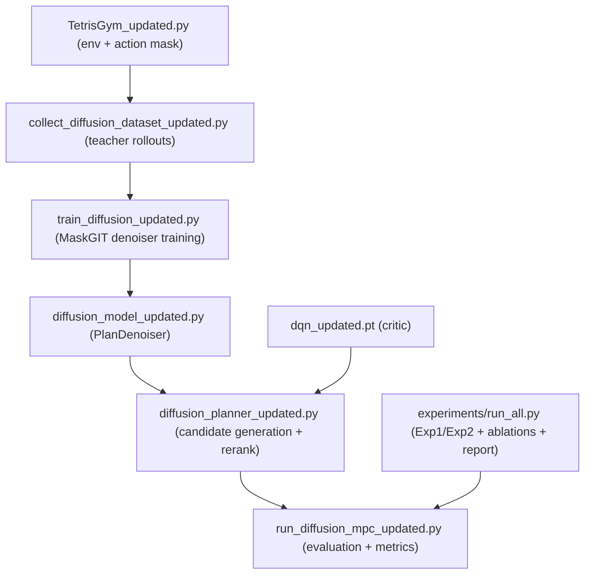

# End-to-End Workflow Chart

```mermaid
flowchart TD
    A["TetrisGym_updated.py (env + action mask)"] --> B["collect_diffusion_dataset_updated.py (teacher rollouts)"]
    B --> C["train_diffusion_updated.py (MaskGIT denoiser training)"]
    C --> D["diffusion_model_updated.py (PlanDenoiser)"]
    D --> E["diffusion_planner_updated.py (candidate generation + rerank)"]
    E --> F["run_diffusion_mpc_updated.py (evaluation + metrics)"]
    G["dqn_updated.pt (critic)"] --> E
    H["experiments/run_all.py (Exp1/Exp2 + ablations + report)"] --> F
```

